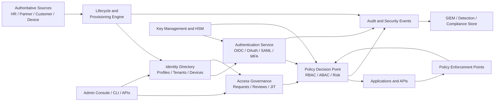

# Enterprise Identity and Access Management (IAM) Platform

## 1. Document Control

| Field | Value |
|---|---|
| Document status | Draft for architecture and delivery review |
| Owner | Identity Platform Product and Engineering |
| Technical owner | Chief Information Security Office / Platform Architecture |
| Reviewers | Security, Privacy, Legal, Compliance, SRE, Application Engineering |
| Classification | Internal - Security Sensitive |
| Version | 1.0 |
| Last updated | 2026-09-10 |
| Review cadence | Quarterly and after material architecture or regulatory changes |

### 1.1 How to Use This Document

This document is the delivery blueprint for an enterprise IAM platform. It defines the target outcomes, platform boundaries, security controls, engineering standards, operating model, and release gates required to move from discovery to production.

Organization-specific values must be completed before implementation:

- Supported jurisdictions and data residency requirements
- Authoritative identity sources and HR/accounting system owners
- Required applications, tenants, environments, and trust relationships
- Regulatory obligations and evidence retention periods
- Recovery objectives, budget, staffing, and service tier
- Approved cloud, regions, vendors, and cryptographic key management service

## 2. Executive Summary

The IAM platform provides centralized identity lifecycle management, authentication, authorization, federation, privileged access controls, auditability, and policy enforcement for workforce, partner, customer, machine, and service identities.

The platform must make the secure path the easiest path while preserving least privilege, strong authentication, tenant isolation, operational resilience, and complete accountability. It is a shared security service, not merely a login screen.

### 2.1 Business Outcomes

- Reduce unauthorized access and identity-related breach risk.
- Automate joiner, mover, leaver, and access review processes.
- Provide consistent SSO and MFA across enterprise applications.
- Establish policy-based, auditable access decisions.
- Reduce operational effort and time to onboard or offboard users.
- Improve evidence quality for internal and external audits.
- Provide a reusable platform for workforce, B2B, B2C, and workload identities.

### 2.2 Success Measures

| Outcome | Initial target | Measurement |
|---|---:|---|
| Critical applications behind SSO | >= 95% | Application inventory and connection registry |
| MFA coverage for human identities | 100% for privileged; >= 98% workforce | Authentication telemetry |
| Leaver disablement | <= 15 minutes from authoritative event | Lifecycle event timestamps |
| Privileged standing access | 0 by default | Privileged access reports |
| Access review completion | >= 98% before due date | Review workflow records |
| Authentication availability | >= 99.99% monthly | SLO monitoring |
| Audit event delivery | >= 99.99% accepted | Event pipeline metrics |
| Critical vulnerabilities past SLA | 0 | Security findings register |

## 3. Scope

### 3.1 In Scope

- Identity directory and identity profile management
- Workforce, partner, customer, service, workload, and device identity patterns
- Authentication, MFA, passwordless, adaptive access, and session management
- SSO using OIDC, OAuth 2.0, and SAML 2.0
- Provisioning and deprovisioning using SCIM, APIs, events, and connectors
- Role-based and attribute-based authorization
- Entitlement catalog, access requests, approvals, and access reviews
- Privileged identity and just-in-time access workflows
- Secrets, signing keys, certificates, and key rotation integration
- Audit trails, security analytics, alerting, and compliance evidence
- Administrative APIs, developer tooling, documentation, and support processes
- High availability, disaster recovery, backup, restore, and incident response

### 3.2 Out of Scope Unless Separately Approved

- Replacing the enterprise HR, ERP, CRM, or device management system
- Building a general-purpose SIEM or endpoint detection platform
- Managing application-specific business authorization rules in the IAM core
- Storing payment card data or unrelated sensitive business data
- Custom cryptography or unmanaged key storage
- Bypassing application security ownership through central policy alone

## 4. Guiding Principles

1. **Zero Trust:** Authenticate and authorize every request using current context; do not infer trust from network location.
2. **Least privilege:** Grant the minimum permissions required for the minimum time.
3. **Secure defaults:** New identities, applications, roles, and integrations deny access until explicitly configured.
4. **Separation of duties:** No single operator can request, approve, grant, and verify sensitive access.
5. **Automation first:** Lifecycle changes originate from authoritative systems and are reconciled automatically.
6. **Explicit tenancy:** Tenant, organization, and data boundaries are enforced in code, data access, and logs.
7. **Observable by design:** Every important identity and access decision is attributable and measurable.
8. **Interoperability:** Prefer open standards and versioned contracts over proprietary coupling.
9. **Privacy by design:** Collect only required data, minimize retention, and support subject rights.
10. **Recoverability:** Identity services must continue or degrade safely during dependency and regional failures.

## 5. Personas and Responsibilities

| Persona | Primary needs | Responsibilities |
|---|---|---|
| Employee | SSO, MFA, self-service recovery | Protect credentials and report suspicious activity |
| Manager | Approve team access and reviews | Validate business need and remove stale access |
| Application owner | Integrate applications and define entitlements | Maintain integration, claims, and authorization mapping |
| IAM administrator | Operate policies, connectors, and directory | Follow change control and separation of duties |
| Security analyst | Investigate identity signals and incidents | Monitor, triage, contain, and preserve evidence |
| Auditor | Verify controls and evidence | Independently assess control operation |
| Customer or partner admin | Manage organization members | Operate within tenant and delegated permissions |
| Developer | Consume platform APIs and SDKs | Follow integration standards and protect secrets |
| Platform SRE | Maintain reliability and recoverability | Operate SLOs, capacity, backup, and recovery |
| Data subject | Understand and control personal data | Exercise privacy rights through approved channels |

## 6. Target Capabilities

### 6.1 Identity Lifecycle

- Create, update, suspend, restore, merge, and delete identities.
- Correlate records using stable immutable identifiers; never use email as the primary key.
- Support authoritative source precedence and conflict resolution.
- Generate idempotent lifecycle events with ordering metadata and correlation IDs.
- Reconcile source and target state on a scheduled basis.
- Quarantine ambiguous, duplicate, or malformed records for human resolution.
- Apply retention, legal hold, anonymization, and deletion policies.

### 6.2 Authentication

- OIDC Authorization Code with PKCE for user-facing applications.
- OAuth 2.0 client credentials or workload identity federation for services.
- SAML 2.0 for legacy enterprise integrations.
- Phishing-resistant MFA using FIDO2/WebAuthn or approved equivalent.
- Recovery controls that do not weaken the assurance level of the original factor.
- Risk-based step-up authentication based on device, location, behavior, resource, and session context.
- Secure session issuance, rotation, revocation, idle timeout, absolute timeout, and logout.
- Rate limiting, credential stuffing protection, breached-secret detection, and lockout safeguards.

### 6.3 Authorization

- Central policy decision and policy enforcement points with fail-closed behavior for protected operations.
- RBAC for stable job or function responsibilities.
- ABAC for context, resource ownership, geography, environment, and risk conditions.
- Relationship-based authorization where organization, project, or resource relationships are material.
- Versioned policies with peer review, test cases, impact analysis, and rollback.
- Explicit deny precedence and conflict handling.
- Consistent authorization decisions across APIs, jobs, user interfaces, and administrative tools.

### 6.4 Governance and Administration

- Application and API registration with owner, data classification, contacts, and lifecycle dates.
- Entitlement catalog with descriptions, risk, data scope, approvers, and expiration rules.
- Access request and approval workflows with business justification.
- Periodic access certification and escalation for overdue reviews.
- Just-in-time privileged access with time limits, reason codes, and session evidence.
- Delegated administration limited by tenant, organization, resource, and operation.
- Break-glass access with strong protection, monitoring, and mandatory post-use review.

### 6.5 Developer and Integration Experience

- Versioned REST APIs and event contracts.
- Official SDKs for supported languages where demand justifies maintenance.
- Local development guidance using non-production tenants and test identities.
- Reference integrations for web, mobile, API, service-to-service, CLI, and batch workloads.
- Contract tests, sandbox environments, migration guides, and deprecation policy.
- No secrets in source code, client-side bundles, issue trackers, or logs.

### 6.6 End-to-End Feature Catalog

The feature IDs below are the canonical product backlog grouping. Every feature must include authorization, audit events, telemetry, tests, documentation, an operational runbook, and rollback or recovery behavior.

| ID | Feature | Priority | End-to-end acceptance criteria |
|---|---|---:|---|
| FND-001 | Tenant and organization management | P0 | Create, configure, suspend, and retire tenants with enforced isolation, ownership, policies, and audit history. |
| FND-002 | Identity and resource directory | P0 | Store human, service, workload, device, application, resource, and organization records with immutable IDs. |
| FND-003 | Platform administration console | P0 | Authorized operators can search and mutate only permitted objects; high-risk actions require confirmation and reason. |
| FND-004 | Versioned platform API | P0 | APIs support authentication, scopes, pagination, filtering, idempotency, optimistic concurrency, rate limits, and consistent errors. |
| FND-005 | Health, limits, and feature flags | P0 | Dependencies, quotas, rollout flags, readiness, and customer-safe status are observable and controllable. |
| IDN-001 | Human identity registration | P0 | Create identities with verified attributes, duplicate detection, consent, tenant assignment, and audit evidence. |
| IDN-002 | Service and workload identity registration | P0 | Register non-human identities with owner, purpose, environment, scope, expiry, and rotation metadata. |
| IDN-003 | Profile and attribute management | P0 | Read and update allowed fields with source precedence, validation, field authorization, and history. |
| IDN-004 | Account state management | P0 | Activate, suspend, lock, restore, and retire identities with reason, actor, effective time, and events. |
| IDN-005 | Identity search and duplicate resolution | P1 | Scoped search protects privacy; duplicate records are quarantined, merged safely, and reconciled downstream. |
| AUTH-001 | OIDC authorization code with PKCE | P0 | Exact redirect matching, state, nonce, PKCE, consent, token validation, logout, and error handling are implemented. |
| AUTH-002 | OAuth 2.0 resource server | P0 | APIs validate issuer, audience, signature, time claims, tenant, scopes, and token type consistently. |
| AUTH-003 | SAML federation | P0 | Provider metadata, signed assertions, audience, recipient, claims, certificate rollover, and logout are supported. |
| AUTH-004 | Password and breached-secret protection | P0 | Passwords use approved hashing, breach checks, rate limits, lockout safeguards, and non-enumerating errors. |
| AUTH-005 | Passkeys and phishing-resistant MFA | P0 | Users can enroll, use, revoke, and recover strong factors with assurance tracking and audit evidence. |
| AUTH-006 | Account recovery | P0 | Recovery verifies identity, expires challenges, prevents enumeration, revokes risky sessions, and preserves assurance. |
| AUTH-007 | Adaptive and step-up authentication | P0 | Device, location, behavior, resource, and risk context can permit, challenge, or deny access with policy evidence. |
| AUTH-008 | Session and token lifecycle | P0 | Rotation, idle and absolute expiry, revocation, device visibility, logout, and breach response are supported. |
| FED-001 | External identity provider registration | P0 | Providers have approved owners, metadata, domains, claims, assurance, certificate expiry, and status. |
| FED-002 | SCIM inbound provisioning | P0 | Create, update, deactivate, group, pagination, idempotency, error, and reconciliation behavior are supported. |
| FED-003 | SCIM outbound provisioning | P0 | Users and groups are provisioned and deprovisioned with retries, dead letters, drift detection, and replay. |
| FED-004 | Authoritative source connector | P0 | HR, partner, or customer changes produce ordered, idempotent, traceable lifecycle events with conflict handling. |
| FED-005 | Connector catalog and reconciliation | P0 | Connectors have owners, scopes, credentials, health, retry policy, drift reports, and decommission workflow. |
| APP-001 | Application registration | P0 | Every application has owner, environment, data classification, redirect URIs, support contact, and lifecycle dates. |
| APP-002 | OAuth client and secret management | P0 | Approved grants, scopes, key or secret authentication, rotation, revocation, and vault integration are enforced. |
| APP-003 | API resource and claim configuration | P0 | Audiences, scopes, claims, data minimization, tenant context, and policy requirements are versioned and tested. |
| APP-004 | Consent and application approval | P0 | High-risk permissions require purpose, approval, expiry where needed, notification, and revocation. |
| APP-005 | Application certification and retirement | P1 | Integration tests pass before production; retirement disables clients, grants, provisioning, and preserves evidence. |
| RBAC-001 | Permission and role catalog | P0 | Permissions and roles have purpose, owner, risk, scope, review date, and version. |
| RBAC-002 | RBAC and group assignment | P0 | Assignments enforce tenant scope, approval, expiry, separation of duties, and audit requirements. |
| RBAC-003 | ABAC and relationship authorization | P0 | Subject, resource, action, tenant, environment, device, risk, and relationships are evaluated consistently. |
| RBAC-004 | Policy authoring and versioning | P0 | Policies are reviewed, tested, impact-analyzed, approved, published, monitored, and rollback-capable. |
| RBAC-005 | Policy simulation and decision service | P0 | Authorized users can simulate changes; runtime decisions are low-latency, explainable, and fail safely. |
| IGA-001 | Entitlement catalog | P0 | Grantable access includes description, risk, data scope, owner, approver, duration, and eligibility. |
| IGA-002 | Access request and approval workflow | P0 | Users request access with justification; routing supports multi-stage approval, delegation, rejection, and escalation. |
| IGA-003 | Time-bound access and renewal | P0 | Access has start and end times, automatic expiry, renewal rules, and advance notifications. |
| IGA-004 | Access review campaigns | P0 | Campaigns assign reviewers, capture decisions, escalate overdue tasks, revoke access, and preserve evidence. |
| IGA-005 | Joiner, mover, leaver automation | P0 | Source events recalculate access, revoke stale permissions, provision valid access, and report exceptions. |
| IGA-006 | Access analytics and evidence export | P1 | Dormant, excessive, toxic, orphaned, and anomalous access is discoverable and exportable with integrity metadata. |
| PAM-001 | Privileged role inventory | P0 | Privileged roles, permissions, members, owners, risk, and review dates are continuously discoverable. |
| PAM-002 | Just-in-time elevation | P0 | Eligible administrators request narrow, time-limited access with risk checks, reason, approval, and expiry. |
| PAM-003 | Break-glass and high-risk approvals | P0 | Emergency and key or policy operations use independent monitoring, dual control, rollback, and post-use review. |
| AUD-001 | Immutable audit trail | P0 | Identity, authentication, authorization, lifecycle, administration, and policy events are tamper-evident and searchable. |
| AUD-002 | Security analytics and SIEM integration | P0 | Events support correlation, detection, delivery monitoring, retry, deduplication, and alert health. |
| AUD-003 | Compliance reporting and retention | P0 | MFA, privileged access, reviews, offboarding, exceptions, retention, and legal holds produce audit-ready evidence. |
| AUD-004 | Privacy rights workflows | P1 | Verified access, correction, export, restriction, and deletion requests follow jurisdictional policy. |
| KEY-001 | Signing key lifecycle | P0 | Keys are generated, stored, overlapped, rotated, revoked, and retired using approved HSM or vault controls. |
| KEY-002 | Certificate and client secret lifecycle | P0 | Owners, expiry alerts, renewal, rollover, revocation, and secret redaction are enforced. |
| OPS-001 | SLO dashboards and error budgets | P0 | Authentication, authorization, lifecycle, governance, and audit SLOs are measured and actionable. |
| OPS-002 | Backup, restore, and regional failover | P0 | Recovery meets approved RTO and RPO; keys, queues, policies, audit integrity, and tenant isolation are verified. |
| OPS-003 | Incident response and emergency controls | P0 | Incidents capture severity, timeline, evidence, containment, communications, recovery, and follow-up. |
| OPS-004 | Queue, connector, and replay operations | P0 | Operators can inspect backlog, retry safe work, quarantine poison messages, replay events, and verify results. |
| DEV-001 | Developer portal and sandbox tenants | P0 | Developers can register apps, test with synthetic identities, view docs, inspect health, and avoid production secrets. |
| DEV-002 | SDKs, webhooks, and reference integrations | P1 | Supported stacks have secure examples, signed events, retry guidance, token validation, and migration support. |
| UX-001 | Accessible sign-in and self-service | P0 | Sign-in, MFA, recovery, sessions, devices, connected applications, and access requests work on supported clients. |
| UX-002 | Administration and support experience | P0 | Operators see scope, impact, policy, reason, evidence, and recovery options before high-risk mutations. |

### 6.7 End-to-End Business Journeys

#### Joiner, Mover, and Leaver

1. An authoritative source creates or changes a person record.
2. The lifecycle engine validates, correlates, and applies tenant and source-precedence rules.
3. Birthright access, role changes, or revocations are calculated against policy.
4. Access is provisioned or removed through connectors with retries, dead letters, and reconciliation.
5. Authentication, sessions, credentials, notifications, and audit evidence are updated.
6. Owners receive an exception report when any downstream target does not confirm the change.

**Acceptance:** Every transition is idempotent, traceable by correlation ID, completed within the approved SLA, and recoverable without cross-tenant access.

#### Application Onboarding

1. The owner registers the application, environment, data classification, redirect URIs, claims, scopes, and support contacts.
2. The platform provisions an isolated client and approved key or secret through the vault.
3. Automated protocol, claim, tenant, authorization, resilience, and security tests run in a sandbox.
4. Security and platform owners approve production access.
5. The release uses health gates, dashboards, alerts, progressive rollout, and rollback.

**Acceptance:** The application has a named owner, certified integration, documented runbook, expiry monitoring, and retirement path.

#### Access Request, Review, and Revocation

1. A user selects an entitlement and submits business justification.
2. Eligibility, existing access, risk, and separation-of-duties rules are evaluated.
3. Required managers, resource owners, and security reviewers approve or reject.
4. Approved access is provisioned with an expiry and notification.
5. A review campaign later certifies or revokes the access.
6. Revocation is propagated and verified across every target.

**Acceptance:** Request, decision, grant, review, and removal are attributable, immutable, exportable, and automatically expired when required.

#### Privileged Elevation and Compromise Response

1. An administrator requests narrow, time-bound elevation with a reason.
2. Risk, device assurance, separation of duties, and approval rules are evaluated.
3. Access is activated, monitored, and automatically expired.
4. If compromise is suspected, sessions, tokens, factors, keys, and grants are revoked according to severity.
5. Security operations preserves evidence, contains the incident, verifies recovery, and completes post-incident review.

**Acceptance:** No standing privilege is created by default; containment, recovery, and all high-risk actions are measurable and auditable.

#### Disaster Recovery

1. Monitoring detects regional, dependency, data, queue, or key-management failure.
2. Incident command activates the approved failover or degraded-mode runbook.
3. Traffic, queues, policies, keys, and audit pipelines recover or replay safely.
4. Authentication, authorization, lifecycle consistency, and tenant isolation are verified.
5. Service returns to normal and recovery evidence is retained.

**Acceptance:** Approved RTO and RPO are demonstrated without data loss beyond the contract or cross-tenant exposure.

### 6.8 Release Slices

| Release | Required capabilities | Outcome |
|---|---|---|
| P0 Foundation | FND, IDN, AUTH core, APP core, RBAC core, AUD core, KEY core, OPS core | Secure production pilot for identity, authentication, and authorization |
| P0 Lifecycle | FED, IGA core, joiner/mover/leaver journeys | Automated provisioning, governance, and offboarding |
| P0 Privileged | PAM core, break-glass, high-risk approvals | No default standing privileged access |
| P1 Governance | Reviews, analytics, evidence, privacy rights | Audit-ready enterprise governance |
| P1 Scale | Failover, performance, developer portal, SDKs, connectors | Broad enterprise adoption and operational scale |

### 6.9 Cross-Feature Definition of Done

- Functional behavior, negative paths, tenant isolation, and authorization rules are implemented.
- Unit, integration, contract, end-to-end, security, performance, and recovery tests are present.
- Audit events, metrics, traces, dashboards, alerts, and privacy redaction are implemented.
- API, event, UI, migration, administrator, and support documentation is published.
- Threat model, data-flow review, security assessment, and compliance mapping are updated.
- Failure modes, retry behavior, idempotency, rollback, and recovery are tested.
- Owner, support contact, runbook, SLO, escalation path, and release approval are assigned.

## 7. Reference Architecture

### 7.1 Logical Components

| Component | Responsibility | Availability requirement |
|---|---|---|
| Identity directory | Store normalized identities, organizations, devices, and status | Multi-zone; regional recovery |
| Authentication service | Authenticate subjects and issue tokens or assertions | Highest SLO; stateless where possible |
| Policy service | Evaluate authorization and access conditions | Horizontally scalable; cache only with bounded staleness |
| Lifecycle engine | Process source changes and provisioning jobs | Durable queues; replay and reconciliation |
| Connector framework | Integrate SCIM, LDAP, APIs, and events | Isolated failures and per-connector retry policy |
| Governance service | Requests, approvals, reviews, and evidence | Durable workflow state |
| Audit pipeline | Produce immutable, searchable security events | Durable ingestion and backpressure |
| Key management integration | Protect signing, encryption, and secret material | HSM-backed keys; rotation and revocation |
| Admin and developer portals | Configure, operate, and integrate the platform | Strong admin controls and auditability |

### 7.2 Trust Boundaries

- Public client boundary: browser, mobile, and external integrations are untrusted.
- Tenant boundary: every request must carry and be authorized for an explicit tenant context.
- Control-plane boundary: policy, configuration, keys, and administrative operations require elevated controls.
- Data-plane boundary: runtime authentication and authorization must remain available without exposing control-plane secrets.
- Integration boundary: source and target systems are independently failing and must be isolated.
- Security boundary: audit records and key material require stronger access controls than operational data.

## 8. Identity and Data Model

### 8.1 Core Entities

- **Subject:** Stable identity for a human, service, workload, device, or external principal.
- **Organization/Tenant:** Security and data isolation boundary with lifecycle and policy settings.
- **Credential:** Password, passkey, MFA factor, certificate, or external identity binding; store references and metadata, not recoverable secrets.
- **Application:** Registered relying party or resource server with owners and lifecycle state.
- **Client:** OAuth/OIDC client with redirect URI, grant, scope, and authentication configuration.
- **Resource:** Protected API, project, record, or other authorization target.
- **Role:** Named collection of permissions with owner, risk, and lifecycle metadata.
- **Permission:** Atomic action and resource scope.
- **Entitlement:** Grantable access package that maps a subject to roles or permissions.
- **Policy:** Versioned rule set that evaluates subject, action, resource, and context.
- **Session:** Authenticated interaction with assurance, device, risk, and expiration metadata.
- **Audit event:** Immutable record of an identity, authentication, authorization, administrative, or lifecycle action.

### 8.2 Data Rules

- Use immutable, opaque identifiers and never expose sequential database IDs.
- Encrypt sensitive data in transit and at rest using approved enterprise controls.
- Classify every field as public, internal, confidential, or restricted.
- Keep authentication secrets, recovery codes, tokens, and private keys out of general identity records.
- Record timestamps in UTC and use a trusted time source.
- Enforce tenant scope in repository queries and service-layer authorization.
- Define retention per data class and jurisdiction; deletion must be verifiable.
- Redact personal data and tokens from logs, traces, errors, and analytics dimensions.

## 9. Security Requirements

### 9.1 Cryptography and Key Management

- Use approved, maintained cryptographic libraries and secure random generation.
- Use asymmetric signing keys protected by an HSM or managed key service where supported.
- Maintain key metadata, owner, purpose, algorithm, creation date, activation date, expiry, and status.
- Support overlap during rotation so existing tokens can be validated safely.
- Rotate signing, encryption, and integration secrets according to risk and policy.
- Revoke compromised keys and credentials through an emergency procedure tested at least annually.

### 9.2 Token and Session Controls

- Use short-lived access tokens and narrowly scoped refresh tokens.
- Validate issuer, audience, signature, algorithm, expiry, not-before, nonce, and tenant claims.
- Do not accept unsigned tokens or algorithm substitution.
- Bind redirect URIs exactly; reject wildcard and unregistered redirects.
- Use state and nonce protections for browser authentication flows.
- Revoke sessions after credential reset, high-risk detection, account disablement, or administrator action.
- Prevent token leakage through URLs, referrers, logs, browser storage, and error messages.

### 9.3 Administrative Controls

- Require phishing-resistant MFA for administrators and privileged operators.
- Separate platform administration, policy approval, key administration, and audit review roles.
- Require dual control for key operations, break-glass changes, and high-risk policy changes.
- Log all configuration changes before and after mutation, including actor and reason.
- Apply just-in-time elevation and automatic expiration to privileged access.
- Review administrator access at least quarterly and after role changes.

### 9.4 Threat Model

Maintain a living threat model covering at minimum:

- Account takeover, credential stuffing, phishing, and MFA fatigue
- Token theft, replay, substitution, and confused deputy attacks
- Tenant breakout and cross-organization data exposure
- Privilege escalation through role, group, policy, or approval manipulation
- Malicious or compromised connectors and authoritative sources
- Supply-chain compromise in dependencies, build systems, or integrations
- Denial of service against authentication and lifecycle processing
- Audit tampering, log injection, and evidence deletion
- Insider abuse and unauthorized break-glass use
- Privacy leakage through claims, logs, search, and analytics

## 10. API and Event Standards

### 10.1 API Requirements

- Use versioned endpoints and backward-compatible changes by default.
- Require authenticated, authorized callers with explicit scopes.
- Support idempotency keys for create, update, provisioning, and workflow operations.
- Return consistent error shapes with a correlation ID and actionable classification.
- Apply pagination, filtering, field selection, rate limits, and maximum request sizes.
- Use optimistic concurrency for mutable administrative resources.
- Do not expose internal stack traces, secrets, policy internals, or unnecessary personal data.
- Publish an OpenAPI contract and validate it in CI.

### 10.2 Event Requirements

- Include event ID, type, schema version, occurred-at, producer, tenant, subject, correlation ID, and causation ID.
- Make consumers idempotent and support duplicate delivery.
- Use durable delivery, bounded retries, dead-letter handling, and replay controls.
- Preserve ordering only where the business contract requires it; document partition keys.
- Do not place credentials, access tokens, or unnecessary personal data in events.
- Sign or integrity-protect events when crossing a trust boundary.

## 11. Availability, Resilience, and Disaster Recovery

### 11.1 Service Objectives

Define and approve objectives per service before production launch:

| Service | Availability SLO | RTO | RPO |
|---|---:|---:|---:|
| Authentication and token issuance | 99.99% | 60 minutes | <= 5 minutes |
| Authorization decisions | 99.99% | 60 minutes | <= 5 minutes |
| Directory reads | 99.99% | 60 minutes | <= 5 minutes |
| Lifecycle provisioning | 99.9% | 4 hours | <= 15 minutes |
| Governance workflows | 99.9% | 4 hours | <= 15 minutes |
| Audit ingestion | 99.99% accepted | 4 hours | No loss after acknowledgment |

### 11.2 Resilience Controls

- Deploy across multiple availability zones and approved regions as required.
- Remove single points of failure from authentication, policy, directory, queues, and key dependencies.
- Use timeouts, bounded retries with jitter, circuit breakers, bulkheads, and backpressure.
- Fail closed for authorization and high-risk operations; use explicitly approved bounded degradation for low-risk reads.
- Keep emergency access independent enough to recover from ordinary control-plane failures.
- Test backup restoration, regional failover, key recovery, queue replay, and dependency isolation.
- Document dependency failure behavior and customer-visible impact.

## 12. Observability and Audit

### 12.1 Required Telemetry

- Authentication success, failure, challenge, recovery, and risk signals
- Authorization allow, deny, policy version, resource class, and decision latency
- Identity creation, modification, suspension, deletion, and source correlation
- Provisioning attempts, retries, drift, dead letters, and reconciliation results
- Access requests, approvals, denials, expirations, and review completion
- Privileged elevation, break-glass use, key operations, and policy changes
- SLO indicators, dependency health, saturation, queue depth, and error budgets

### 12.2 Audit Event Minimums

Every security-relevant event must include actor, actor type, action, target, tenant, outcome, timestamp, source, correlation ID, request ID, reason where applicable, and before/after values for administrative changes. Events must be tamper-evident, access controlled, retained according to policy, and exportable for investigations and audits.

### 12.3 Alerting

Create actionable alerts for impossible travel or anomalous authentication, MFA changes, repeated failures, privilege escalation, break-glass use, disabled identity activity, consent or redirect changes, signing-key changes, policy weakening, connector drift, audit pipeline gaps, and cross-tenant authorization failures.

## 13. Privacy and Compliance

- Maintain a record of processing activities for IAM personal data.
- Define lawful basis, purpose, data minimization, retention, and deletion for each data class.
- Support access, correction, export, restriction, and deletion workflows where required.
- Separate operational identity data from security evidence when retention requirements differ.
- Restrict claims and directory attributes to the minimum needed by each application.
- Document data residency, cross-border transfers, subprocessors, and breach notification paths.
- Map controls to applicable frameworks such as ISO 27001, SOC 2, NIST, PCI DSS, HIPAA, GDPR, or regional requirements as applicable.
- Preserve evidence of control operation without exposing more personal data than necessary.

## 14. Engineering and Delivery Lifecycle

### 14.1 Environments

Use isolated development, integration, staging, and production environments. Production identities, credentials, keys, data, and tenants must not be reused in lower environments. Environment configuration must be versioned, reviewed, and injected through an approved secret or configuration service.

### 14.2 CI/CD Gates

Every change must pass:

- Formatting, linting, static analysis, type checking, and unit tests
- API and event contract validation
- Dependency, container, secret, and license scanning
- SAST, DAST, and relevant software composition analysis
- Authorization and tenant-isolation tests
- Migration compatibility and rollback checks
- Infrastructure policy and drift checks
- Performance, resilience, and security regression tests for affected components
- Peer review with an identified owner and rollback plan

### 14.3 Release Strategy

Use progressive delivery with feature flags, canaries, health checks, automated rollback, and an explicit change record. High-risk authentication, policy, key, and directory changes require a security review and a tested recovery procedure before production release.

### 14.4 Definition of Done

A feature is complete only when its code, tests, API/event contract, threat-model impact, observability, access controls, documentation, operational runbook, migration/rollback plan, and ownership are complete and reviewed.

## 15. Testing Strategy

- **Unit tests:** validation, policy logic, token handling, lifecycle state transitions.
- **Integration tests:** directory, key management, queues, connectors, and external identity providers.
- **Contract tests:** APIs, claims, provisioning, event schemas, and SDK behavior.
- **End-to-end tests:** login, MFA, SSO, consent, access request, approval, review, and offboarding.
- **Negative tests:** expired tokens, wrong audience, tenant mismatch, replay, privilege escalation, and policy conflicts.
- **Security tests:** threat scenarios, abuse cases, fuzzing, dependency defects, secret exposure, and penetration testing.
- **Resilience tests:** dependency outage, queue backlog, region loss, key rotation, restore, and failover.
- **Performance tests:** authentication peaks, policy latency, directory reads, provisioning throughput, and audit ingestion.
- **Operational acceptance:** alert quality, dashboards, runbooks, backup restore, and on-call readiness.

Production launch requires no open critical or high security defects unless explicitly accepted by the accountable risk owner with an expiry date and compensating controls.

## 16. Operations Model

### 16.1 On-Call Responsibilities

- Monitor SLOs, error budgets, authentication health, policy latency, and lifecycle queues.
- Triage security and availability alerts using correlation IDs and audit evidence.
- Protect customer access during incidents without weakening security controls silently.
- Communicate status, impact, workaround, recovery, and follow-up actions.
- Record incidents, decisions, timelines, and evidence for post-incident review.

### 16.2 Standard Runbooks

Maintain tested runbooks for:

- Authentication outage or elevated failure rate
- Authorization service unavailable or returning unexpected denies
- Suspected signing-key or credential compromise
- Tenant isolation or data exposure suspicion
- Mass account compromise or MFA abuse
- Connector outage, provisioning backlog, or reconciliation drift
- Unauthorized privileged access or break-glass use
- Data deletion, restore, and disaster recovery
- Emergency policy rollback and emergency application disablement

### 16.3 Incident Severity

| Severity | Example | Response expectation |
|---|---|---|
| Sev 0 | Active compromise, cross-tenant exposure, or platform-wide authentication failure | Immediate executive, security, and incident command response |
| Sev 1 | Major customer or workforce access outage, privileged control failure | 24x7 response and frequent stakeholder updates |
| Sev 2 | Material degradation or contained security event | Same-business-day response and owner assignment |
| Sev 3 | Limited defect, question, or non-urgent policy issue | Normal support and planned remediation |

## 17. Governance and Change Management

- Establish an IAM architecture review board with security, privacy, platform, application, and operations representation.
- Require an owner, data classification, risk rating, support contact, and retirement date for every application integration.
- Review high-risk policies, new trust relationships, custom claims, privileged roles, and key changes before release.
- Maintain an exception register with rationale, compensating controls, owner, expiry, and review date.
- Deprecate APIs and protocols with published timelines and migration support.
- Review platform metrics, incidents, access review results, and control exceptions quarterly.

## 18. Delivery Plan

### Phase 0: Discover and Govern

- Inventory identities, applications, integrations, roles, privileged paths, and data flows.
- Confirm business owners, authoritative sources, jurisdictions, compliance scope, and service objectives.
- Approve threat model, target architecture, control objectives, and product backlog.

### Phase 1: Platform Foundation

- Establish environments, network boundaries, key management, CI/CD, observability, and baseline controls.
- Implement directory, tenant model, audit pipeline, administration, and foundational APIs.
- Validate backup, restore, access control, and operational readiness.

### Phase 2: Authentication and Federation

- Deliver OIDC/OAuth, SAML, MFA, session controls, risk signals, and developer integration paths.
- Onboard pilot applications and representative workforce, partner, and customer journeys.
- Complete security testing, performance testing, and usability validation.

### Phase 3: Lifecycle and Governance

- Integrate authoritative sources and provisioning targets.
- Deliver access catalog, request/approval workflows, reviews, JIT, and reconciliation.
- Measure offboarding, stale access, approval quality, and connector health.

### Phase 4: Scale and Optimize

- Migrate remaining applications and retire redundant identity paths.
- Expand policy automation, analytics, passwordless adoption, and regional resilience.
- Tune cost, performance, developer experience, and support processes.

### Production Exit Criteria

- SLOs demonstrated in a representative production-like environment.
- Disaster recovery and restore exercises completed with recorded results.
- Security assessment and penetration test completed with risk acceptance for any exception.
- Critical integrations have owners, runbooks, dashboards, alerts, and rollback plans.
- Audit, privacy, retention, and access review controls are operational.
- On-call rotation, support model, and customer communications are ready.

## 19. Risk Register Template

| Risk | Impact | Likelihood | Owner | Mitigation | Trigger | Status |
|---|---|---|---|---|---|---|
| Authoritative source outage | Stale access or delayed offboarding | Medium | [Owner] | Queue, replay, reconciliation, manual emergency process | Source SLA breach | Open |
| Key compromise | Token forgery or data exposure | Low | [Owner] | HSM, rotation, revocation, dual control | Key alert | Open |
| Tenant isolation defect | Cross-tenant exposure | Low | [Owner] | Defense-in-depth tests, review, monitoring | Isolation test failure | Open |
| Connector drift | Incorrect entitlements | Medium | [Owner] | Contract tests, reconciliation, quarantine | Drift threshold | Open |
| MFA recovery abuse | Account takeover | Medium | [Owner] | Phishing-resistant recovery and review | Recovery anomaly | Open |

## 20. Required Decision Records

Create and approve ADRs for:

- Identity population and tenant model
- Authoritative source precedence and reconciliation
- Cloud, region, network, and data residency model
- Directory storage and consistency guarantees
- Token format, claims, TTLs, and revocation strategy
- Policy model: RBAC, ABAC, relationship-based, or combination
- Key management, signing algorithms, and rotation process
- Event transport, delivery guarantees, replay, and retention
- Break-glass design and emergency access independence
- Backup, restore, regional failover, and degraded-mode behavior
- API versioning, SDK support, and deprecation policy

## 21. Open Questions

- Which identity populations are in the first production release?
- Which system is authoritative for each lifecycle attribute?
- Which applications require SAML, SCIM, LDAP, or custom adapters?
- Which regulations and data residency constraints apply to each tenant?
- What are the approved regions, cloud services, HSM, SIEM, and ticketing systems?
- Which roles and entitlements are considered privileged or high risk?
- What are the final SLO, RTO, RPO, retention, and support commitments?
- Which customer or application teams will participate in the pilot?

## 22. Traceability Matrix

| Requirement area | Design section | Evidence |
|---|---|---|
| Least privilege | Guiding Principles; Authorization | Policy tests, access reviews, role catalog |
| MFA and authentication assurance | Authentication; Security Requirements | Authentication metrics, configuration, test results |
| Lifecycle automation | Identity Lifecycle; Delivery Plan | Source mappings, event logs, reconciliation reports |
| Tenant isolation | Trust Boundaries; Data Rules | Isolation tests, code review, security assessment |
| Availability and recovery | Resilience; Operations | SLO dashboards, restore and failover records |
| Auditability | Observability and Audit | Immutable events, retention configuration, audit exports |
| Privacy | Privacy and Compliance | Data inventory, retention, subject-rights evidence |
| Secure delivery | Engineering Lifecycle; Testing | CI results, threat model, scans, release approvals |

## 23. Approval

| Role | Name | Decision | Date |
|---|---|---|---|
| Product owner | [Name] | Pending | [YYYY-MM-DD] |
| Security owner | [Name] | Pending | [YYYY-MM-DD] |
| Enterprise architect | [Name] | Pending | [YYYY-MM-DD] |
| Privacy or compliance owner | [Name] | Pending | [YYYY-MM-DD] |
| Operations owner | [Name] | Pending | [YYYY-MM-DD] |
